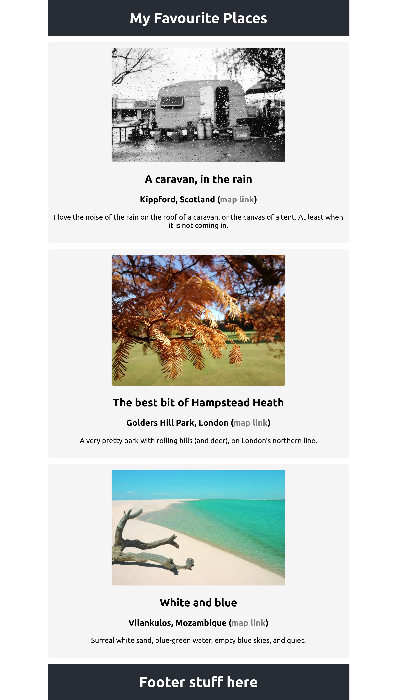

# Academy Project: Favourite Places

> This is part of Academy's [technical curriculum for **The Mark**](https://github.com/WeAreAcademy/curriculum-mark). All parts of that curriculum, including this project, are licensed under a <a rel="license" href="http://creativecommons.org/licenses/by-nc-nd/4.0/">Creative Commons Attribution-NonCommercial-NoDerivatives 4.0 International License</a>.

## Overview

You will make and deploy a single-page React app which will list a few of your favourite places.

Here's an example screenshot to give you a rough idea, but note that the project text below takes precedence over any details from the image. Also, you are free to lay out and style your project as you see fit.

## Setup

- Create a new React app on your machine called `favourite-places-react`. See the following instructions on React project setup. Make sure you set up with TypeScript (and not the JavaScript default). [Guide to React project creation setup (with TypeScript)](https://www.notion.so/weareacademy/How-to-create-a-React-app-with-TypeScript-76643f84db564a69a04db9a0b6a2f2e7)

- Publish the project repo on your github account.

## Exercises:

### Exercise: Get your bearings!

Create React App makes a React project which has **many** files you won't need to modify at all. 

For this exercise, you'll start by editing `src/App.tsx`

Take some time to look at the contents of that source file and its rendered output in the browser.

### Exercise: Create the app!

The app's single page should have:

- a page header showing a suitable title.
- at least four "place" entries (see details below)
- a page footer including - at least - attribution for any images used.

Each "place" entry should have:

- a title (text)
- a place name (text)
- a country name (text)
- a main image (URL)
- a link to the rough location on google maps (or alternative) (URL)
- some text explaining why you like the place

**Regarding components**

Create a React component to represent a `Place`.
Parameterise it with props so that you can reuse the component for each of your favourite places.

You are free to make other components (either for subcomponents of a Place, or for other elements of the page).

**Regarding images**

You can find free photos at unsplash: https://unsplash.com/ and pexels: https://www.pexels.com/

**Regarding layout and styling**

You can lay the page out and style it as you like, but don't spend a long time on it - it's really not the focus here.  

Once you have your app working (however ugly it is) we recommend going on to the next step (deployment) and then possibly returning to tweak visual aspects later on in the week (e.g. to try out new things you've learned).

### Exercise: Deploy to netlify

Set up continuous deployment of your site to [netlify](https://netlify.app/) and make sure it has deployed.

[Netlify deployment guide for React apps](https://www.notion.so/weareacademy/How-to-deploy-a-React-app-to-free-Netlify-hosting-9e6ebd4dcb814cb483c34eb0f05ea96e)

## Ideas for more work

- HTML: Link to another classmate's site in your footer to make a ring of "favourite places" sites.
- HTML: Make a table of contents or other navigation to take you directly to a chosen Place section.
- TypeScript & React: Make it data-driven. Store your places in an array of objects, and loop over them to create your list of places.  The exercise [favourite-places-map](https://github.com/WeAreAcademy/mark-react-basics-proj--favourite-places-map) tasks you to do this.
- CSS: Learn to use css grid or flexbox to lay out your places in a grid.
- CSS: Make it look good on mobile devices, too.
- Advanced: Embed a google map for each place
- Advanced: Embed a google map showing markers for each place.

## Further resources

- Free stock photos at unsplash: https://unsplash.com/ and pexels: https://www.pexels.com/ though you are encouraged to use your own images if you like.

## Credits
